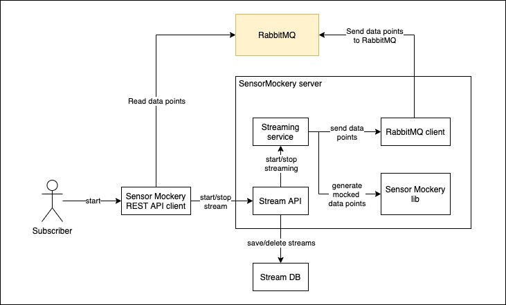

# :robot: Sensor Mockery server
A server that makes use of the sensor mockery lib to send mocked data over http to service brokers

## Current architectural overview

Our target architecture is documented in our [docs repo](https://github.com/sensormockery/docs).

| Component     | Description   |
| ------------- |---------------|
| Sensor Mockery REST API client | An example client using defining functions for interaction with the REST API of Sensor Mockery Server. |
| Sensor Mockery server | The server that streams mocked data to message brokers. |
| Stream API | Defines the REST API for communication with Sensor Mockery server. Can be called to start and stop streams. |
| Stream DB | Used as a lock storage for streams. This way when a server instance fails then it would lose the lock it's streams and new the instance would continue sending the old streams. |
| Streaming service | A goroutine that runs in parallel with the Stream API. Stream API calls it to start sending mocks to the RabbitMQ. |
| Sensor Mockery lib | A library written C that is used to generate the mocked data points. |
| RabbitMQ client | A client that is used by the Streaming service to send messages to a RabbitMQ broker. |
| RabbitMQ | The currently supported message broker type. |

The common scenario is:
1. The client initiates a call to start the streaming service
1. The stream API locks the stream to the given server instance in the db and then calls the streaming service to start streaming data points to the given broker.
1. The data points are sent to the broker.
1. The data points are read by the client.
1. The client stop the stream after a specific time.

## Contribution

In order to contribute you would have to follow our [development guidelines](./docs/development_guide.md).